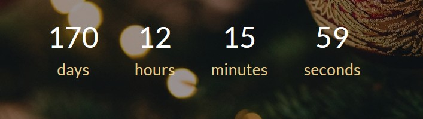

# Таймер обратного отсчёта

Простой таймер обратного отсчета с днями, часами, минутами и секундами. Создан на чистом CSS и Javascript (без зависимостей). Отслеживает время до наступления нового года.

## **Выполненные шаги**

* Установлена правильная дата окончания
* Вычислено оставшееся время
* Дата приведена к удобному формату
* Отображены данные таймера на странице

## **Описание проекта**

Присутствует мобильная адаптация приложения до ширины в 320px.

## **Стек технологий**

## [**Демо**](https://alekseeva-t-v.github.io/countdown-new-year/)
